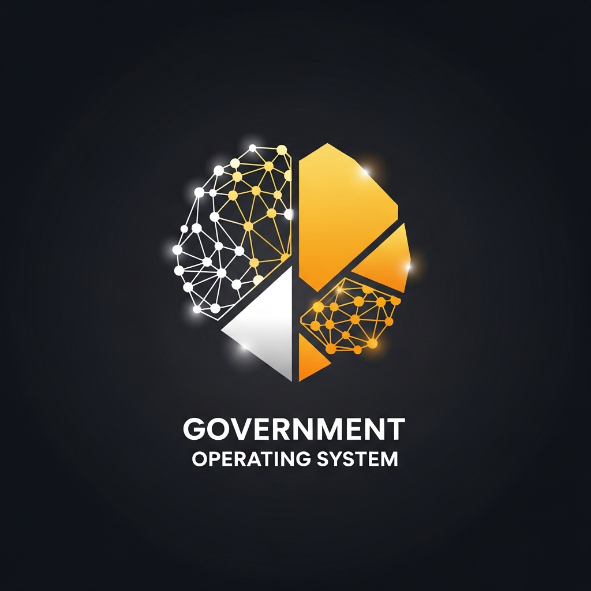

<div align="center">



<br/>
<br/>

# BharatOS — Unified Agentic Mesh

### *India's First AI-Powered Operating System for Public & Private Sectors*

<br/>

[](https://bharat-automator-os.replit.app)
[](https://www.typescriptlang.org/)
[](https://react.dev/)
[](https://nodejs.org/)
[](https://www.postgresql.org/)
[](https://razorpay.com/)
[](https://vitejs.dev/)
[](LICENSE)

<br/>

<p>
  
  
  
  
</p>

<br/>

> **"One platform. Four sectors. 1.4 billion citizens."**
>
> BharatOS orchestrates specialized AI agents across Agriculture, Finance, Healthcare & Governance — powered by India Stack, real-time weather intelligence, and enterprise-grade security.

<br/>

---

</div>

<br/>

## Why BharatOS?

India has **300+ government portals**, **22 official languages**, and **1.4 billion citizens** who need seamless access to digital services. BharatOS solves this by creating an **Agentic Mesh** — a network of AI agents that understand Indian context, speak Indian languages, and automate complex multi-step workflows.

**This is not another dashboard.** This is a digital nervous system for Bharat.

<br/>

## Platform Highlights

<table>
<tr>
<td width="33%" align="center">

### Command Center
Real-time system monitoring with live metrics, active agents tracker, recent activity feed, and platform health indicators

</td>
<td width="33%" align="center">

### AI Assistant
GPT-powered conversational AI that answers citizen queries about digital services, government schemes, and compliance

</td>
<td width="33%" align="center">

### Task Automator
Multi-agent execution engine with real-time logs from Delegator, Scraper, Analyzer & Generator agents

</td>
</tr>
<tr>
<td align="center">

### Data Science Lab
Interactive analytics dashboard for processing data patterns with beautiful visualizations

</td>
<td align="center">

### Profit Engine
Revenue optimization with smart insights and automation for freelancers and businesses

</td>
<td align="center">

### Invoice Generator
Professional GST-compliant invoice generation with export capabilities

</td>
</tr>
<tr>
<td align="center">

### Payment Processing
Razorpay-powered UPI, cards, net banking & wallets with 3-layer security and RBI compliance

</td>
<td align="center">

### Weather & Disaster Analytics
Real-time weather for any location worldwide + earthquake monitoring + 7-day forecasts

</td>
<td align="center">

### Architecture Visualizer
Interactive mesh graph (React Flow) and system diagrams showing the full platform architecture

</td>
</tr>
</table>

<br/>

---

<br/>

## Sector Agents — The AI Workforce

BharatOS deploys specialized AI agents for each sector of the Indian economy:

<table>
<tr>
<td width="25%" align="center">

### KrishiBot
**Agriculture**

- Crop yield prediction using IoT + ISRO satellite data
- Real-time market intelligence via Agmarknet
- Trade execution on e-NAM/ONDC
- Soil health monitoring
- Weather-based crop advisory

</td>
<td width="25%" align="center">

### TaxBot Prime
**Finance & IT**

- Automated GST return filing
- Income Tax (ITR) automation
- Freelance bidding on Contra, Truelancer, Upwork
- Financial compliance checks
- Invoice generation with HSN codes

</td>
<td width="25%" align="center">

### ArogyaBot
**Healthcare**

- ABDM/ABHA health ID integration
- Digital patient history management
- Emergency 108 ambulance dispatch
- Medicine interaction checker
- Telemedicine appointment booking

</td>
<td width="25%" align="center">

### SarkarBot
**Governance**

- Scheme eligibility via MyScheme/NSP
- Automated application submission
- DigiLocker document fetch
- RTI filing automation
- Scholarship & pension tracking

</td>
</tr>
</table>

<br/>

---

<br/>

## India Stack Integration

BharatOS is deeply integrated with India's Digital Public Infrastructure:

```
 ╔══════════════════════════════════════════════════════════════════╗
 ║                     INDIA STACK INTEGRATION                      ║
 ╠════════════════╦════════════════╦════════════════╦═══════════════╣
 ║   Aadhaar      ║     UPI        ║  DigiLocker    ║   Bhashini    ║
 ║   e-KYC Auth   ║   Real-Time    ║  Document      ║  Translation  ║
 ║   OTP Verify   ║   Payments     ║  Vault         ║  22 Languages ║
 ║   Biometric    ║   QR Collect   ║  Verified IDs  ║  Speech-Text  ║
 ╠════════════════╬════════════════╬════════════════╬═══════════════╣
 ║                        ABDM (ABHA)                               ║
 ║          Health ID • Patient Records • Hospital Network          ║
 ╚══════════════════════════════════════════════════════════════════╝
```

| Service | Integration | Use Case |
|---------|------------|----------|
| **Aadhaar** | OTP-based e-KYC via UIDAI | Identity verification for all services |
| **UPI** | Real-time payment with intent generation | Instant payments, QR collect, autopay |
| **DigiLocker** | Pull verified documents | PAN, Aadhaar, Marksheets, Land Records |
| **Bhashini** | AI-powered NLP | 22 Indian language translation |
| **ABDM** | ABHA Health ID | Digital health records management |

<br/>

---

<br/>

## Weather & Disaster Intelligence

BharatOS includes a **real-time weather and disaster monitoring** system — no API key required:

- **12 Major Indian Cities** — Live temperature, humidity, wind speed, conditions
- **Worldwide Location Search** — Search any city, village, or place on Earth with autocomplete
- **7-Day Forecast** — Extended weather outlook with min/max temperatures
- **Earthquake Monitoring** — Live seismic activity from USGS with magnitude & depth
- **24-Hour Hourly Charts** — Detailed temperature trends for any searched location
- **GPS Support** — Auto-detect your location for instant local weather
- **Search History** — Quick access to previously searched locations

> Powered by [Open-Meteo](https://open-meteo.com/) (Weather) and [USGS](https://earthquake.usgs.gov/) (Earthquakes) — 100% free, no API key needed.

<br/>

---

<br/>

## Tech Stack

<table>
<tr>
<td align="center" width="16%">

**Frontend**

React 19
Vite 7
Tailwind CSS 4
Framer Motion
React Flow v12
Shadcn/UI
Recharts

</td>
<td align="center" width="16%">

**Backend**

Express 5
Node.js 24
Pino Logger
Zod Validation
esbuild
CORS + Helmet

</td>
<td align="center" width="16%">

**Database**

PostgreSQL 16
Drizzle ORM
Qdrant Vector DB
Connection Pool

</td>
<td align="center" width="16%">

**AI / ML**

OpenAI GPT-4
LangGraph
CrewAI Swarms
Bhashini NLP
Embeddings

</td>
<td align="center" width="16%">

**Payments**

Razorpay SDK
UPI Integration
HMAC-SHA256
RBI Compliant

</td>
<td align="center" width="16%">

**DevOps**

pnpm Monorepo
TypeScript 5.9
ESLint + Prettier
GitHub Actions
Replit Deploy

</td>
</tr>
</table>

<br/>

---

<br/>

## Architecture

```
bharat-automator-os/
│
├── artifacts/                          # Deployable applications
│   ├── api-server/                     # Express 5 REST API
│   │   └── src/
│   │       ├── routes/
│   │       │   ├── index.ts            # Route registry
│   │       │   ├── payments.ts         # Razorpay integration
│   │       │   ├── weather.ts          # Real-time weather + earthquakes
│   │       │   ├── agents.ts           # AI agent orchestration
│   │       │   ├── indiastack.ts       # Aadhaar, UPI, DigiLocker
│   │       │   ├── analytics.ts        # Platform analytics
│   │       │   └── invoices.ts         # Invoice generation
│   │       └── index.ts               # Server entry point
│   │
│   ├── bharat-automator/               # React + Vite frontend
│   │   └── src/
│   │       ├── pages/
│   │       │   ├── AdminPanel.tsx       # Command Center dashboard
│   │       │   ├── AIAssistant.tsx      # GPT-powered chat
│   │       │   ├── WeatherAnalytics.tsx # Weather & disaster monitoring
│   │       │   ├── ContactSupport.tsx   # Contact & support page
│   │       │   ├── PaymentsPage.tsx     # Razorpay payments
│   │       │   └── ...                 # 10+ more pages
│   │       ├── components/
│   │       │   ├── layout/Sidebar.tsx   # Premium sidebar navigation
│   │       │   └── ui/                 # Shadcn/UI components
│   │       └── App.tsx                 # Router & app shell
│   │
│   └── mockup-sandbox/                 # Component prototyping
│
├── lib/                                # Shared libraries
│   ├── api-spec/                       # OpenAPI 3.1 specification
│   ├── api-client-react/               # Generated React Query hooks
│   ├── api-zod/                        # Generated Zod validators
│   ├── db/                             # Drizzle ORM schema + migrations
│   └── integrations/                   # AI integration utilities
│
├── scripts/                            # Utility & seed scripts
├── pnpm-workspace.yaml                 # Monorepo configuration
└── tsconfig.base.json                  # Shared TypeScript config
```

<br/>

---

<br/>

## API Reference

### Core APIs
| Method | Endpoint | Description |
|--------|----------|-------------|
| `GET` | `/api/health` | Health check with uptime & version |
| `GET` | `/api/auth/user` | Authenticated user profile (OIDC) |
| `GET` | `/api/orchestrator/status` | Agent orchestrator node status |
| `POST` | `/api/orchestrator/dispatch` | Dispatch multi-agent task |

### Weather & Disaster APIs
| Method | Endpoint | Description |
|--------|----------|-------------|
| `GET` | `/api/weather/current` | Live weather for 12 Indian cities |
| `GET` | `/api/weather/search?q=` | Geocoding autocomplete (worldwide) |
| `GET` | `/api/weather/location?lat=&lng=&name=&region=` | Custom location weather + 24hr hourly |
| `GET` | `/api/weather/earthquakes` | Recent earthquakes from USGS |

### India Stack APIs
| Method | Endpoint | Description |
|--------|----------|-------------|
| `POST` | `/api/indiastack/auth-aadhaar` | Aadhaar e-KYC OTP verification |
| `POST` | `/api/indiastack/upi-payment` | UPI payment intent generation |
| `GET` | `/api/indiastack/digilocker-docs` | Fetch DigiLocker documents |

### Sector Agent APIs
| Method | Endpoint | Description |
|--------|----------|-------------|
| `POST` | `/api/agriculture/predict-yield` | AI crop yield prediction |
| `POST` | `/api/agriculture/execute-trade` | Market trade on e-NAM |
| `POST` | `/api/finance/file-gst` | Automated GST return filing |
| `POST` | `/api/finance/file-income-tax` | ITR automation |
| `POST` | `/api/healthcare/book-emergency` | 108 ambulance dispatch |
| `POST` | `/api/governance/apply-scheme` | Government scheme application |

### Payment APIs
| Method | Endpoint | Description |
|--------|----------|-------------|
| `POST` | `/api/payments/create-order` | Create Razorpay order |
| `POST` | `/api/payments/verify` | Verify signature (timing-safe HMAC) |
| `GET` | `/api/payments/config` | Public payment configuration |

<br/>

---

<br/>

## Security Architecture

BharatOS implements **enterprise-grade security** at every layer:

| Layer | Protection | Implementation |
|-------|-----------|----------------|
| **Authentication** | OpenID Connect with PKCE | Replit OIDC provider |
| **Secret Management** | Encrypted environment secrets | Never in code or git history |
| **Payment Security** | Timing-safe signature verification | `crypto.timingSafeEqual()` — prevents timing attacks |
| **Error Sanitization** | Auto-redaction of sensitive values | Regex-based key scrubbing |
| **Data Protection** | DPDPA 2023 compliant | India's Digital Personal Data Protection Act |
| **API Security** | Rate limiting + CORS + Helmet | Express middleware stack |
| **Database** | Encrypted connections | PostgreSQL SSL + connection pooling |

<br/>

---

<br/>

## Quick Start

### Prerequisites

- **Node.js** 24+ | **pnpm** 10+ | **PostgreSQL** database

### Installation

```bash
# Clone the repository
git clone https://github.com/dwivedidayashankar31-art/bharat-automator-os.git
cd bharat-automator-os

# Install all dependencies
pnpm install

# Set up environment variables
cp .env.example .env
# Configure: DATABASE_URL, RAZORPAY_KEY_ID, RAZORPAY_KEY_SECRET

# Push database schema
pnpm --filter @workspace/db run push

# Generate API client from OpenAPI spec
pnpm --filter @workspace/api-spec run codegen

# Start both servers (API + Frontend)
pnpm --filter @workspace/api-server run dev &
pnpm --filter @workspace/bharat-automator run dev
```

### Environment Variables

| Variable | Description | Required |
|----------|-------------|:--------:|
| `DATABASE_URL` | PostgreSQL connection string | Yes |
| `RAZORPAY_KEY_ID` | Razorpay public key | Yes |
| `RAZORPAY_KEY_SECRET` | Razorpay secret key | Yes |
| `PORT` | API server port (default: 8080) | Yes |

<br/>

---

<br/>

## Roadmap

- [x] Central Orchestrator with LangGraph agent mesh
- [x] 4 Sector Agents — Agriculture, Finance, Healthcare, Governance
- [x] India Stack — Aadhaar, UPI, DigiLocker, Bhashini, ABDM
- [x] Razorpay Payments with 3-layer security
- [x] AI Assistant with streaming GPT chat
- [x] Data Science & Analytics Dashboard
- [x] Real-Time Weather & Disaster Analytics (worldwide)
- [x] Contact & Support Portal with 6 channels
- [x] Live Analytics with platform metrics
- [x] Invoice Generator with GST compliance
- [x] Premium Glassmorphism UI with dark theme
- [ ] Agent Marketplace — discover & deploy community agents
- [ ] Mobile App — React Native / Expo
- [ ] WhatsApp Business API — conversational agent access
- [ ] IRCTC Railway Booking Agent
- [ ] Voter ID & Election Services Agent
- [ ] Multi-language UI (Hindi, Tamil, Bengali, Marathi...)

<br/>

---

<br/>

## Contributing

We welcome contributions from the open-source community!

```
1. Fork the repository
2. Create your feature branch    →  git checkout -b feature/your-feature
3. Commit your changes           →  git commit -m "Add: your feature description"
4. Push to your branch           →  git push origin feature/your-feature
5. Open a Pull Request           →  We'll review and merge!
```

Whether it's a new sector agent, bug fix, UI improvement, or documentation — every contribution matters.

<br/>

---

<br/>

## Contact & Support

| Channel | Details |
|---------|---------|
| **Founder** | Er. Dayashankar Dwivedi |
| **Email** | dwivedidayashankar31@gmail.com |
| **Phone** | +91 74896 55562 |
| **WhatsApp** | [Chat on WhatsApp](https://wa.me/917489655562) |
| **LinkedIn** | [Dayashankar Dwivedi](https://www.linkedin.com/in/dayashankar-dwivedi) |
| **GitHub** | [dwivedidayashankar31-art](https://github.com/dwivedidayashankar31-art) |
| **Location** | Panna, Madhya Pradesh, India |

<br/>

---

<br/>

## License

This project is licensed under the **MIT License** — see the [LICENSE](LICENSE) file for details.

<br/>

---

<br/>

<div align="center">


<br/>
<br/>

**Built with passion for India by Er. Dayashankar Dwivedi**

*Empowering 1.4 billion citizens through AI-driven automation*

<br/>

<sub>If this project inspires you, please consider giving it a star on GitHub.</sub>

</div>
